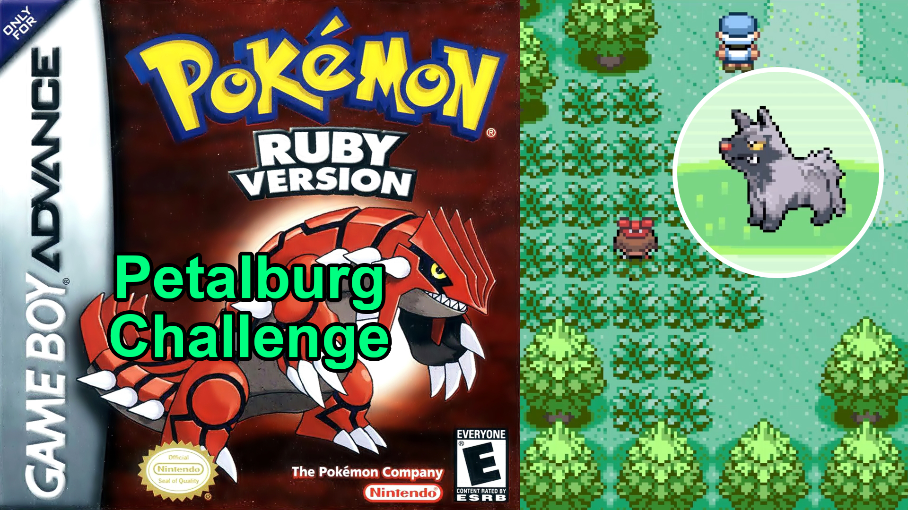

# Pokemon Petalburg Challenge (Gen 3)

Updated 31/05/2025

### Overview

You haven’t quite adjusted to the Hoenn region just yet. To help you on your journey to becoming the Champion, you decide to assemble a team of Pokemon that remind you of your new home in Littleroot Town. You also feel bad for defeating the Poochyena that attacked Professor Birch. This Pokemon will now be your new proxy first partner as part of the Challenge!

This is a fun, narrative-driven challenge and therefore there are no Nuzlocke-style level caps, rules for fainted Pokemon or other restrictions on gameplay. These tougher challenges are great, but the Petalburg Challenge is for the casual Pokemon fan returning to the Hoenn region or perhaps playing the game for the first time!

### The Rules

1. The player must not catch any wild Pokemon encountered beyond Petalburg City
  
2. The player may not have traded or gifted Pokemon in their team
  
3. The player may fish (not Surf) to catch wild Pokemon once they are not doing so beyond Petalburg City
  
4. The player must roll a D6 to determine which first partner they choose (randomising the type of their rival’s first partner Pokemon)
  
5. As soon as the player is gifted a Poke Ball, they must catch a wild Poochyena on Route 101 and store their Gen 3 first partner in the PC for the remainder of the game
  

### Notes

- The wild areas you will have access to are Route 101, Route 102, Route 103 and the water areas within Petalburg City. You may backtrack to these areas at any time to add to your Team
  
- The wild areas you will have access to are Route 101, Route 102, Route 103 and the water areas within Petalburg City. You may backtrack to these areas at any time to add to your Team
  
- The D6 roll is important (1-2 Grass, 3-4 Fire, 5-6 Water) because it prevents you from effectively selecting an easier type for your rival’s first partner Pokemon (now that you won’t have your own Gen 3 first partner going forward)
  
- The selection of wild Pokemon available is actually very diverse and there are some really interesting evolution lines to explore. You should have enough variety in your team to cover all major HMs
  

### Useful Links

- [Route 101](https://bulbapedia.bulbagarden.net/wiki/Hoenn_Route_101)
  
- [Route 102](https://bulbapedia.bulbagarden.net/wiki/Hoenn_Route_102)
  
- [Route 103](https://bulbapedia.bulbagarden.net/wiki/Hoenn_Route_103)
  
- [Petalburg City](https://bulbapedia.bulbagarden.net/wiki/Petalburg_City)
  
- [Ruby/Sapphire/Emerald HM compatibility chart](https://pokemondb.net/ruby-sapphire/hms)
  
- [Hoenn Gym leaders](https://www.serebii.net/rubysapphire/gyms.shtml)
  
- [My YouTube series playlist](https://www.youtube.com/playlist?list=PLBBxSYze67ee5i9yrRSJ31u0wqdy7jtBW)
